# ForgeryCheck

ForgeryCheck is a web-based application for detecting image and video forgeries using advanced forensic techniques, including deep learning, Error Level Analysis (ELA), noise analysis, and copy-move detection. Built with Django, it provides an intuitive interface for users to upload files, analyze them for authenticity, and view detailed forensic results.

---

## Features

- **Image Forgery Detection:**  
  - CNN-based classification with ELA.  
  - Mask generation to highlight manipulated regions.  
  - Edge detection, noise variance, and SIFT-based copy-move analysis.  
  - Metadata extraction for uploaded images.

- **Video Forgery Detection:**  
  - Deep learning-based video forgery detection.  
  - Frame-level analysis and forged frame count.  
  - Video metadata extraction.

- **User Management:**  
  - Registration, login, and profile management.  
  - Analysis history (placeholder for future implementation).

- **Modern UI:**  
  - Responsive design with Bootstrap 5 and crispy forms.  
  - Drag-and-drop file upload with instant preview.

---

## Demo

### Homepage
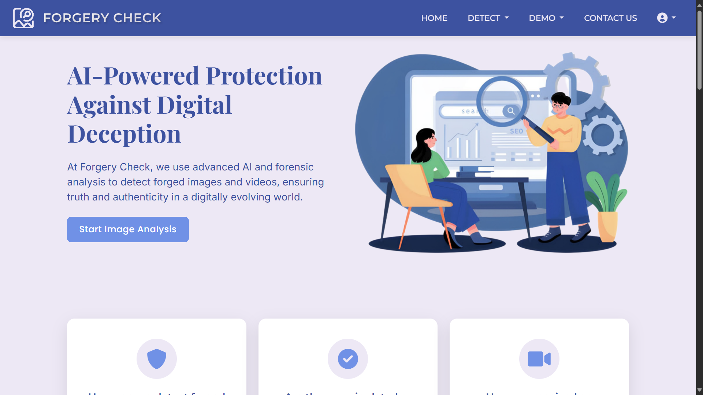

---

## Image Forgery Detection

### Image Forgery Workflow
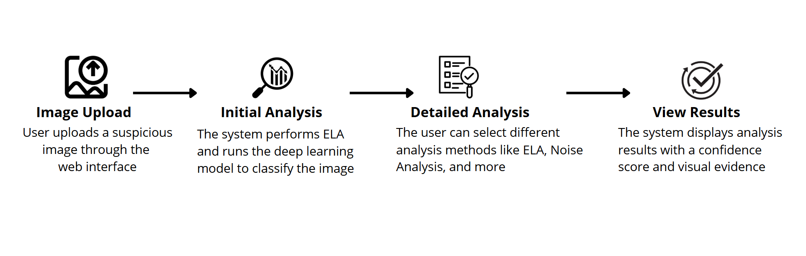

### Authentic Image Result
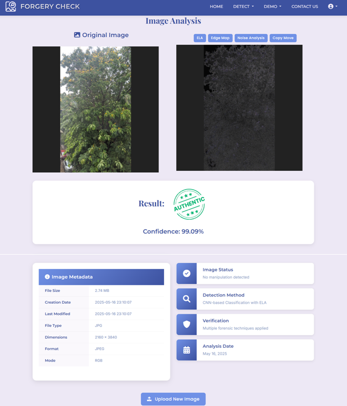

### Forged Image Result


#### ELA Output
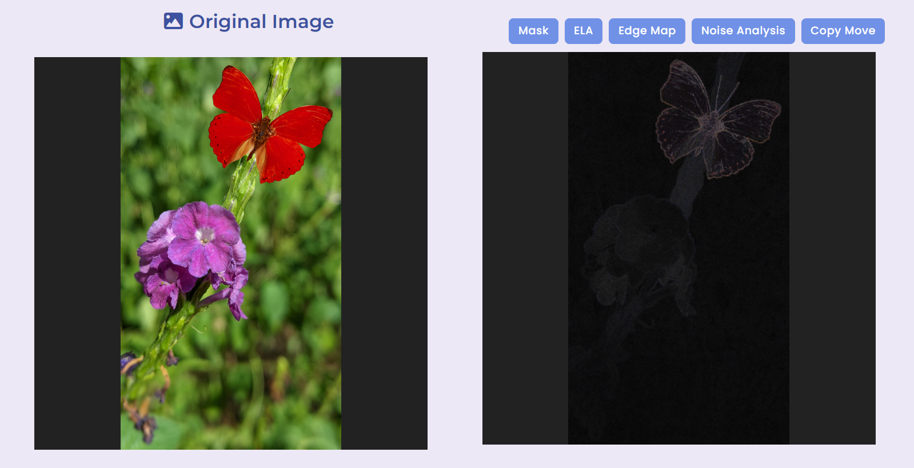

#### Mask Output
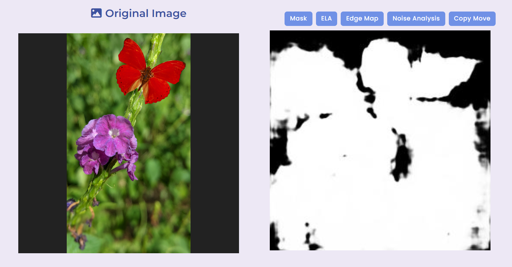

#### Edge Map Output
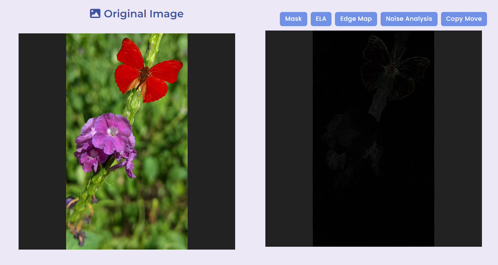

#### Noise Analysis Output
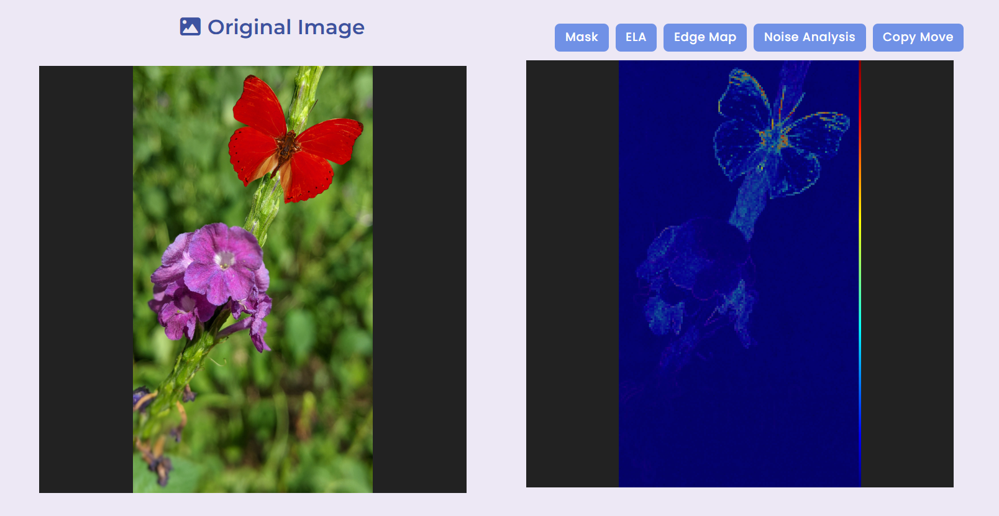

#### Copy-Move Detection Output
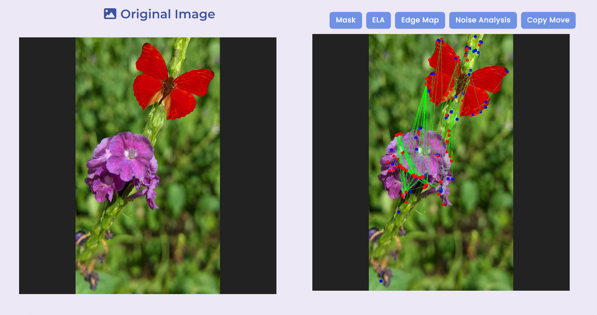

---

## Video Forgery Detection

### Video Forgery Workflow
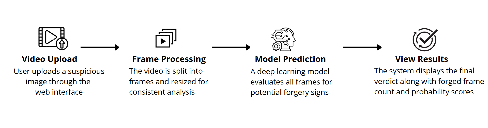

### Authentic Video Result
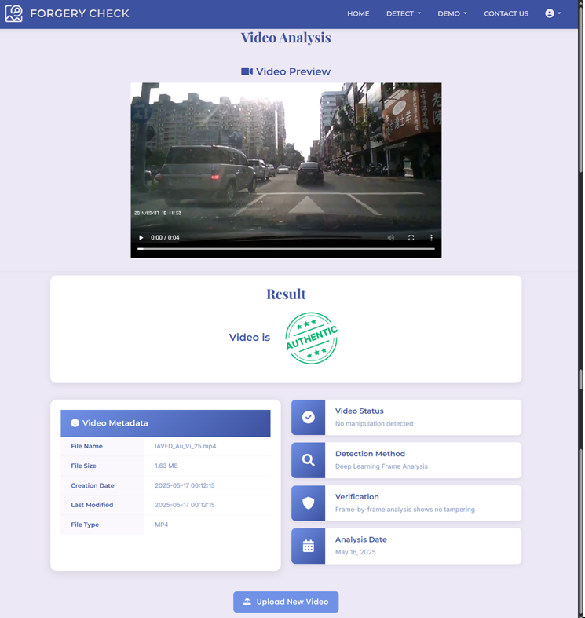

### Forged Video Result
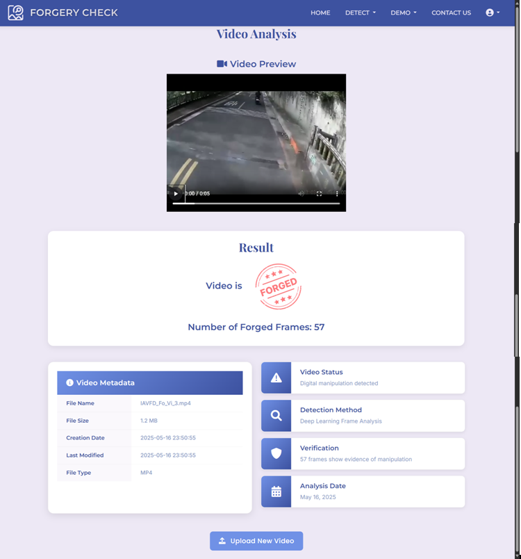

---

## Backend Processing

### Architecture Overview
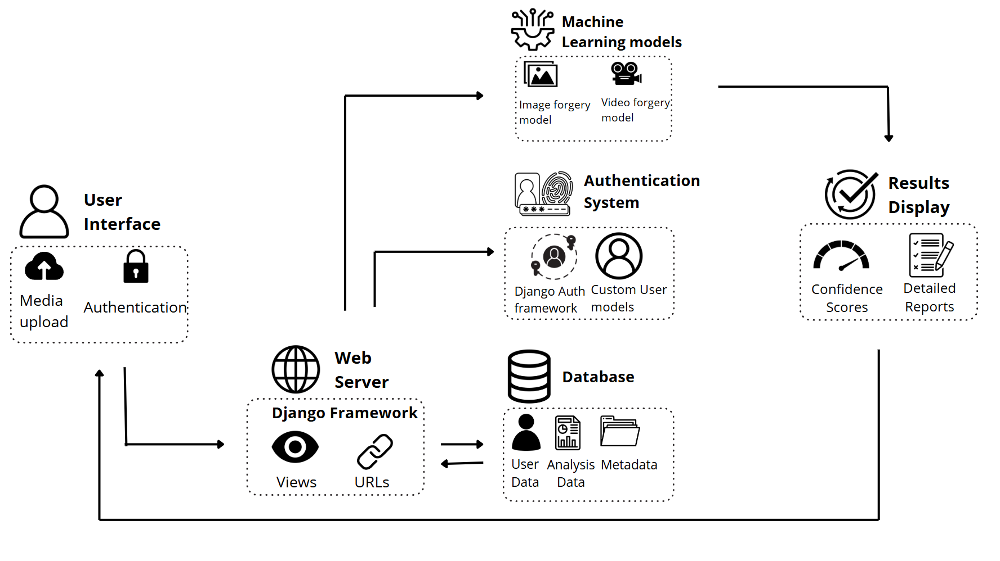

### Backend Process Flow
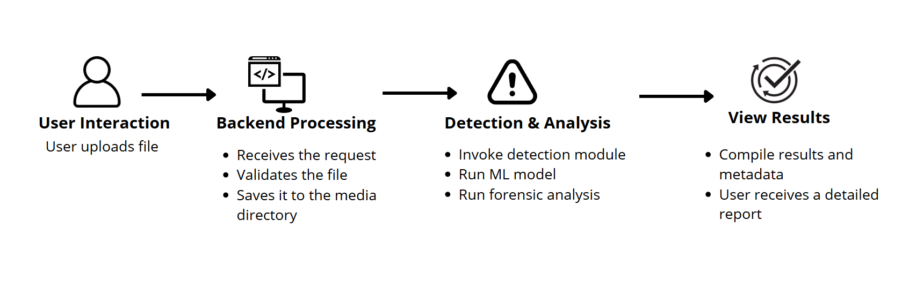

---

## Getting Started

### Prerequisites

- Python 3.9+
- pip (Python package manager)
- [ffmpeg](https://ffmpeg.org/) (for video metadata extraction)
- [hachoir](https://pypi.org/project/hachoir/) (for metadata extraction)
- (Optional) [Git](https://git-scm.com/) for cloning the repository

### Installation

1. **Clone the repository:**
    ```bash
    git clone https://github.com/yourusername/ForgeryCheck.git
    cd ForgeryCheck
    ```

2. **Create and activate a virtual environment (recommended):**
    ```bash
    python -m venv venv
    venv\Scripts\activate
    ```

3. **Install dependencies:**
    ```bash
    pip install -r requirements.txt
    ```

4. **Install ffmpeg:**
    - Download and install ffmpeg from [ffmpeg.org](https://ffmpeg.org/download.html).
    - Add ffmpeg to your system PATH.

5. **Apply migrations:**
    ```bash
    python manage.py migrate
    ```

6. **Create a superuser (for admin access):**
    ```bash
    python manage.py createsuperuser
    ```

7. **Run the development server:**
    ```bash
    python manage.py runserver
    ```

8. **Access the app:**  
   Open your browser and go to [http://127.0.0.1:8000/](http://127.0.0.1:8000/)

---

## Usage

- **Image Analysis:**  
  Upload an image via the homepage or "Image Analysis" section. The app will display authenticity results, ELA visualization, and allow further forensic analysis (mask, edge map, noise, SIFT).

- **Video Analysis:**  
  Upload a video file in the "Video Analysis" section. The app will process the video, display authenticity results, forged frame count, and show extracted metadata.

- **User Features:**  
  Register or log in to access your profile and (future) analysis history.

---

## Project Structure

````

ForgeryCheck/
├── ForgeryCheck/           # Django project settings
├── website/                # Main Django app
│   ├── ImageForgeryDetection/   # Image analysis modules
│   ├── VideoForgeryDetection/   # Video analysis modules
│   ├── templates/               # HTML templates
│   ├── static/                  # Static files (JS, CSS, images)
│   ├── models.py                # (Placeholder for future DB models)
│   ├── views.py                 # Django views
│   └── ...
├── media/                  # Uploaded files and generated outputs
├── ml\_models/              # Pre-trained model files (.h5)
├── requirements.txt
├── manage.py
└── README.md

````

---

## Models & Algorithms

- **Image Forgery Detection:**  
  - Deep CNN model trained on ELA images.  
  - Mask segmentation model for manipulated region localization.  
  - SIFT-based copy-move detection.  
  - Noise and edge analysis for forensic evidence.

- **Video Forgery Detection:**  
  - Deep learning model (ResNet50) for frame-level forgery detection.

- **Metadata Extraction:**  
  - Uses `hachoir` and `ffprobe` for extracting file and media metadata.

---

## Configuration

- **Settings:**  
  - All settings are in `ForgeryCheck/settings.py`.  
  - Static files are served from `/static/`, media files from `/media/`.  
  - Update `ALLOWED_HOSTS` for production deployment.

- **Models:**  
  - Place your trained model files in the `ml_models/` directory.

---

## Presentations & Report

- [ForgeryCheck_PPT 1.pdf](presentations/ForgeryCheck_PPT%201.pdf)
- [ForgeryCheck_PPT 2.pdf](presentations/ForgeryCheck_PPT%202.pdf)
- [ForgeryCheck_PPT 3.pdf](presentations/ForgeryCheck_PPT%203.pdf)

> For more technical details, refer to the final project report included in the repository.

---

## Contributing

Contributions are welcome! Please open issues or submit pull requests for improvements, bug fixes, or new features.

---

## License

This project is licensed under the MIT License. See [LICENSE](LICENSE) for details.

---

## Acknowledgements

- [Django](https://www.djangoproject.com/)  
- [OpenCV](https://opencv.org/)  
- [TensorFlow/Keras](https://www.tensorflow.org/)  
- [hachoir](https://pypi.org/project/hachoir/)  
- [Bootstrap](https://getbootstrap.com/)  
- [Crispy Forms](https://django-crispy-forms.readthedocs.io/en/latest/)

---

If you have any suggestions, feel free to open an issue or contribute to the repository!

---
